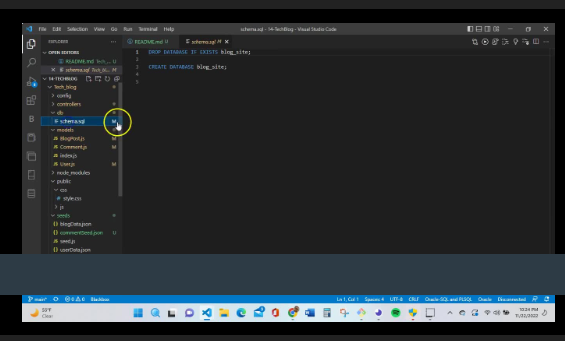

# My Tech Blog

## Description

This project is a blog site that allows for creating, deleting and update posting and comments are able to be left on posting with usernames.

- I wanted to hone in on my handlebars skills and create a blog site that would be eas to use.
- I wanted to practice making a database and having the tables connect correctly so that the site is able to list my created blog and allow to eave comments on the postings of others
- This solves the problem of having regulations on other blog sites and allows me to create any content I so please, within reason.
-I learned that my connections were not being conncected correctly and received assistance to fix those connections.

## Installation

Don't forget to 'npm i' to install all dependencies

## Usage

## Credits

I worked with tutors, T.A's and instructor for help on this assignment, along with ASKBCS

## License

MIT
